# Felicien Hybrid Rice Variety Development Scheme

Elegant scheme diagram based on the approved Gate 1 and Gate 2 design.

Key correction from the original drawing: recurrent GS cycles 1-4 stop after selecting the next 5 R-line parents at F5. Only cycle 5 continues to F7, testcross hybrid production, partner AYT, and hybrid release.

```mermaid
flowchart LR
  %% Styling
  classDef phase fill:#f7f3ea,stroke:#c88b3d,stroke-width:2px,color:#1f2933;
  classDef pop fill:#ffffff,stroke:#6b7280,stroke-width:1.5px,color:#111827;
  classDef action fill:#e8f4f8,stroke:#2b7a8b,stroke-width:1.5px,color:#0f172a;
  classDef select fill:#eaf7ed,stroke:#2d8a55,stroke-width:1.8px,color:#0f172a;
  classDef trial fill:#f3e8ff,stroke:#7c3aed,stroke-width:1.5px,color:#111827;
  classDef model fill:#fff7d6,stroke:#c27a00,stroke-width:1.8px,color:#111827;
  classDef release fill:#ffe8e8,stroke:#c2410c,stroke-width:2px,color:#111827;

  %% Training phase
  subgraph TRAIN["1st cycle: model training and calibration"]
    direction LR
    A["5 fixed elite R-line founders<br/>same outstanding biparental family"]:::pop
    B["5-10 elite x elite crosses<br/>4-6 months"]:::action
    C["800-1000 R-line descendants"]:::pop
    D["SSD/RGA to inbred R lines<br/>F2 to F5/F7, no selection<br/>12-14 months"]:::action
    E["Genotype all R lines<br/>6 months"]:::action
    F["Sparse testcrossing to 2 fixed female testers<br/>high tester connectivity"]:::action
    G["Partner MET<br/>up to 5 locations<br/>max 200 plots/location<br/>sparse phenotyping with high location connectivity"]:::trial
    H["Estimate GCA, SCA, GxE<br/>traits: yield, blast, hoja blanca,<br/>Bulkhoderia, milling yield,<br/>milling quality, white center"]:::trial
    I["Select best 5 R lines<br/>desired-gain index on GCA"]:::select
    M["Train fixed GS model<br/>GCA/index response"]:::model

    A --> B --> C --> D --> E --> F --> G --> H --> I --> M
  end
  class TRAIN phase;

  %% Recurrent phase cycles 1-4
  subgraph RGS["Recurrent GS: cycles 1-4"]
    direction LR
    P0["Current 5 selected R parents"]:::pop
    R1["5-10 R x R crosses<br/>6 months"]:::action
    R2["50 total candidates<br/>SSD/RGA to F5<br/>12 months"]:::action
    R3["Genotype all F5 candidates<br/>6 months"]:::action
    R4["Predict fixed-model index GEBV"]:::model
    R5["Select best 5 F5 candidates<br/>next-cycle parents"]:::select

    P0 --> R1 --> R2 --> R3 --> R4 --> R5
    R5 -. "repeat for cycles 1-4<br/>L = 24 months = 2 years" .-> P0
  end
  class RGS phase;

  %% Cycle 5 and product phase
  subgraph FINAL["Cycle 5: product pipeline"]
    direction LR
    Q0["Cycle 4 selected 5 R parents"]:::pop
    Q1["5-10 R x R crosses<br/>6 months"]:::action
    Q2["50 total candidates<br/>SSD/RGA to F5<br/>12 months"]:::action
    Q3["Genotype all F5 candidates<br/>6 months"]:::action
    Q4["Predict fixed-model index GEBV"]:::model
    Q5["Select best 30 at F5"]:::select
    Q6["Advance selected 30 to F7<br/>4-6 months"]:::action
    Q7["Cross all 30 R lines<br/>to both fixed testers"]:::action
    Q8["60 candidate hybrids<br/>30 R lines x 2 testers"]:::pop
    Q9["Partner AYT<br/>same trait set"]:::trial
    Q10["Release hybrids that outperform<br/>local commercial check for yield"]:::release

    Q0 --> Q1 --> Q2 --> Q3 --> Q4 --> Q5 --> Q6 --> Q7 --> Q8 --> Q9 --> Q10
  end
  class FINAL phase;

  %% Phase links
  M --> P0
  R5 --> Q0
```



## Genetic Gain Timing

For recurrent genetic gain, the relevant cycle is:

```text
selected 5 R parents
-> crossing
-> SSD/RGA to F5
-> genotyping turnaround
-> selected next 5 R parents
```

Baseline cycle time:

```text
6 months + 12 months + 6 months = 24 months = 2 years
```

So recurrent genetic gain per year is:

```text
gain per year = gain per recurrent GS cycle / 2
```

## Product Release Timing

Training/MET and final AYT affect time to release, not the recurrent GS cycle length used for genetic gain per year.

The final product pipeline begins only in cycle 5, after selecting 30 F5 R lines.
